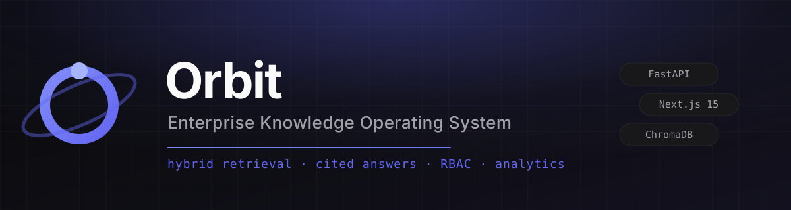
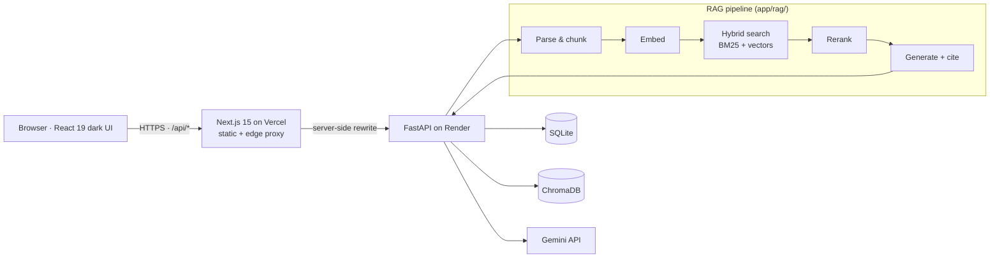

# Orbit



**The enterprise AI knowledge workspace — hybrid retrieval, cited answers, and role-based access in one platform.**

Orbit turns a company's documents into a secure, auditable AI workspace. Employees ask questions in natural language; Orbit retrieves the exact passages with hybrid search (BM25 + vectors + reranking), streams an answer token-by-token, and cites the source document and page for every claim. Permissions run all the way down into retrieval, so nobody sees an answer grounded in a document they cannot open.

<table>
  <tr>
    <td align="center" width="50%"><b>Landing</b><br/></td>
    <td align="center" width="50%"><b>Workspace</b><br/></td>
  </tr>
  <tr>
    <td align="center" width="50%"><b>Knowledge Base</b><br/></td>
    <td align="center" width="50%"><b>Analytics</b><br/></td>
  </tr>
</table>

> **Demo tenant:** everything ships pre-seeded with **NovaTech Systems** — five folders and three accounts (see [Demo data](#demo-data)).

---

## Features

- **Hybrid retrieval** — BM25 keyword search fused with vector similarity, then cross-encoder reranking (`app/rag/`).
- **Cited, streaming answers** — SSE token streaming with source cards (document + page) delivered before the first word.
- **Document pipeline** — upload PDF / DOCX / TXT / Markdown; automatic chunking, embedding and indexing into ChromaDB with per-document status.
- **Role-based access control** — Admin, HR and Engineering roles with folder-level allow-lists and optional per-document grants; enforced *before* retrieval.
- **Enterprise analytics** — admin-only dashboard: search volume, success rate, latency, top documents, top queries, recent searches.
- **Multi-user conversations** — private chat history per account, isolated at the API.
- **Production deployment** — Vercel (frontend) + Render (API) blueprints, same-origin `/api` proxy, health checks, env-driven CORS.

## Tech stack

| Layer | Technology |
| --- | --- |
| Frontend | Next.js 15 (App Router), React 19, TypeScript, Tailwind CSS v4, shadcn/ui, Recharts, Lucide |
| Backend | FastAPI, SQLAlchemy 2, Alembic, Pydantic Settings, structured JSON logging |
| Database | SQLite (file on a persistent disk in production) |
| Vector store | ChromaDB (local persistence) |
| Embeddings | sentence-transformers (local, free) |
| Generation | Google Gemini (any OpenAI-compatible endpoint via `GEMINI_BASE_URL`) |
| Auth | JWT in an HTTP-only `SameSite=Lax` cookie (bcrypt password hashing) |
| Deploy | Vercel (frontend) · Render (API + disk) |

## Architecture



```
                     ┌──────────────────────────────────────────┐
                     │            Browser (client)              │
                     └────────────────────┬─────────────────────┘
                                          │ HTTPS  /api/*
                     ┌────────────────────▼─────────────────────┐
                     │  Frontend — Next.js 15 (Vercel)          │
                     │  landing · workspace · knowledge · dash  │
                     └────────────────────┬─────────────────────┘
                                          │ server-side rewrite (API_PROXY_URL)
                     ┌────────────────────▼─────────────────────┐
                     │  Backend — FastAPI (Render)              │
                     │  JWT cookies · CORS · JSON logs · SSE    │
                     │  /api/health · Alembic migrations        │
                     └───┬─────────────────┬─────────────────┬──┘
                         │                 │                 │
            ┌────────────▼─────┐  ┌────────▼───────┐  ┌──────▼─────────┐
            │ SQLite           │  │ ChromaDB       │  │ Gemini API     │
            │ (disk: orbit.db) │  │ (disk)         │  │ generation     │
            └──────────────────┘  └────────────────┘  └────────────────┘
```

**Design principles** (see [`docs/ARCHITECTURE.md`](docs/ARCHITECTURE.md)):

1. Layered backend — routes → services → models; business logic lives in `app/services`.
2. Contracts first — every request/response is a Pydantic schema.
3. Configuration via environment — all runtime config flows through `app/core/config.py`.
4. Migrations are source-controlled — schema changes only via Alembic revisions.

## Demo data

On first launch with `SEED_DEMO=true`, Orbit idempotently seeds the **NovaTech Systems** tenant:

| Folders | `General` (all roles) · `HR` · `Engineering` · `Product` · `Security` · `Legal` |
| --- | --- |
| **Accounts** | `admin@novatech.com` (Admin) · `hr@novatech.com` (HR) · `eng@novatech.com` (Engineering) |
| **Password** | `Orbit123` (all accounts) |

Role → folder access:

| Folder | Admin | HR | Engineering |
| --- | :---: | :---: | :---: |
| General | ✅ | ✅ | ✅ |
| HR | ✅ | ✅ | — |
| Engineering | ✅ | — | ✅ |
| Product | ✅ | — | ✅ |
| Security | ✅ | — | ✅ |
| Legal | ✅ | ✅ | — |

Run it manually any time:

```bash
cd backend
python -m app.scripts.seed_demo
```

> ⚠️ The demo credentials are public. Set `SEED_DEMO=false` (and rotate the passwords) for a real deployment.

## Local setup

**Prerequisites:** Python 3.9+ · Node 20+ · a Gemini API key (or point `GEMINI_BASE_URL` at any compatible stub).

```bash
git clone <your-repo-url> orbit && cd orbit

# 1 — Backend
cd backend
python3 -m venv .venv && source .venv/bin/activate
pip install -r requirements.txt
cp ../.env.example .env            # then set GEMINI_API_KEY (+ SEED_DEMO=true)
alembic upgrade head
uvicorn app.main:app --reload --port 8000

# 2 — Frontend (new terminal)
cd frontend
npm install
npm run dev                        # http://localhost:3000
```

The frontend proxies `/api/*` to `http://localhost:8000` automatically (`next.config.ts`), so cookies stay first-party and no CORS setup is needed locally.

Open **http://localhost:3000**, click **Try Live Demo**, and sign in with any seeded account.

### Tests

```bash
cd backend && .venv/bin/pytest -q      # 133 tests
cd frontend && npm run lint && npm run build
```

## Deployment

Production topology: **frontend → Vercel**, **API → Render**, one environment variable glues them together (`API_PROXY_URL`).

### 1. Render (API)

1. Push the repo to GitHub.
2. Render → **New → Blueprint** → select this repo (`render.yaml` is picked up automatically).
3. Set the two sync-disabled env vars: `GEMINI_API_KEY` and `CORS_ORIGINS=https://<your-app>.vercel.app`.
4. Deploy. The blueprint runs `alembic upgrade head` at build, serves `/api/health` for health checks, and mounts a persistent disk at `/var/data` (SQLite, Chroma, uploads).
5. Note the service URL, e.g. `https://orbit-api.onrender.com`.

### 2. Vercel (frontend)

1. Vercel → **New Project** → import the repo (`vercel.json` is picked up automatically; root directory `frontend` if prompted).
2. Set env vars:

   | Variable | Value |
   | --- | --- |
   | `API_PROXY_URL` | `https://orbit-api.onrender.com` |
   | `NEXT_PUBLIC_GITHUB_URL` | *(optional)* your repo URL |

3. Deploy. All `/api/*` traffic is rewritten server-side to Render — cookies remain same-origin, so `COOKIE_SECURE=true` works with `SameSite=Lax` as-is.

### 3. Post-deploy checklist

- [ ] `GET https://<api>/api/health` returns `{"status": "ok", ...}`
- [ ] `CORS_ORIGINS` on Render matches the Vercel domain (comma-separated)
- [ ] `COOKIE_SECURE=true`, `DEBUG=false`, `ENVIRONMENT=production`
- [ ] `JWT_SECRET` set (generated by the blueprint) on **all** API instances
- [ ] `SEED_DEMO` consciously set — `true` for the public demo, `false` for real data

### Environment reference

**Backend** (`backend/.env` on your machine, env vars on Render):

| Variable | Default | Purpose |
| --- | --- | --- |
| `GEMINI_API_KEY` / `GEMINI_BASE_URL` | — / Google | Generation provider |
| `DATABASE_URL` | `sqlite:///./data/orbit.db` | SQLAlchemy URL (use `sqlite:////var/data/orbit.db` on Render) |
| `CHROMA_PATH` | `./chroma_db` | Vector store folder |
| `UPLOADS_DIR` | *(empty → `backend/uploads`)* | Uploaded file bytes |
| `JWT_SECRET` | dev fallback | Session signing key — **required in production** |
| `COOKIE_SECURE` | `false` | `true` behind HTTPS |
| `CORS_ORIGINS` | localhost | Comma-separated or JSON list of browser origins |
| `ENVIRONMENT` / `DEBUG` | `development` / `true` | Runtime mode |
| `SEED_DEMO` | `false` | Auto-seed the NovaTech demo tenant at startup |

**Frontend** (`frontend/.env.local` / Vercel):

| Variable | Default | Purpose |
| --- | --- | --- |
| `API_PROXY_URL` | `http://localhost:8000` | Rewrite target for `/api/*` (set to the Render URL in prod) |
| `NEXT_PUBLIC_API_URL` | *(empty → proxy)* | Set only to bypass the proxy (direct mode, needs CORS) |
| `NEXT_PUBLIC_GITHUB_URL` | placeholder | Repo link shown on the landing page |

## API overview

Base URL: `http://localhost:8000/api` (or via the frontend proxy at `/api`). Interactive docs: **`/docs`**.

| Method & path | Auth | Description |
| --- | --- | --- |
| `GET /health` | — | Liveness + database check |
| `POST /auth/register` | — | Create account (first user becomes Admin) |
| `POST /auth/login` | — | Sign in → sets HTTP-only session cookie |
| `GET /auth/me` | cookie | Current user + role |
| `POST /auth/logout` | cookie | Clear session |
| `GET /folders` | cookie | Folders visible to your role (+ doc counts) |
| `POST /folders` | Admin* | Create a folder (with optional role allow-list) |
| `POST /documents/upload` | cookie | Multipart upload → auto-index pipeline |
| `GET /documents` · `GET /documents/{id}` | cookie | List / fetch documents |
| `DELETE /documents/{id}` | cookie | Soft-delete a document |
| `POST /documents/{id}/index` | cookie | Re-index a document |
| `POST /permissions` · `DELETE /permissions` | Admin* | Grant / revoke per-document role access |
| `POST /chat/query` | cookie | Ask a question — JSON or `Accept: text/event-stream` for SSE |
| `GET /chat/history` | cookie | Your conversations + messages |
| `GET /analytics/overview` | Admin | Totals, success rate, latency, unique users |
| `GET /analytics/daily?days=14` | Admin | Zero-filled daily buckets (UTC) |
| `GET /analytics/top-documents` | Admin | Most-cited sources |
| `GET /analytics/top-queries` | Admin | Most frequent queries |
| `GET /analytics/recent` | Admin | 10 newest searches |
| `GET /docs` | — | OpenAPI UI (FastAPI, unauthenticated) |

\* Admin role required for folder/permission writes in practice (enforced by RBAC dependencies).

## Project structure

```
orbit/
├── frontend/                  # Next.js 15 app (Vercel)
│   ├── app/                   # landing · login · workspace · knowledge · dashboard
│   ├── components/
│   │   ├── landing/           # public marketing page
│   │   ├── dashboard/         # analytics charts
│   │   ├── knowledge/         # uploads, folders, document table
│   │   ├── workspace/         # chat UI
│   │   └── ui/                # shadcn/ui primitives
│   ├── lib/                   # api client (same-origin /api), site constants
│   └── next.config.ts         # /api → API_PROXY_URL rewrite
├── backend/                   # FastAPI app (Render)
│   ├── app/
│   │   ├── api/routes/        # health, auth, folders, documents, permissions, chat, analytics
│   │   ├── services/          # business logic incl. demo_seed, storage, auth
│   │   ├── rag/               # parse · chunk · embed · hybrid search · rerank · generate
│   │   ├── models/            # SQLAlchemy models
│   │   ├── schemas/           # Pydantic contracts
│   │   └── scripts/           # python -m app.scripts.seed_demo
│   ├── alembic/               # migrations
│   └── tests/                 # 133 pytest tests
├── docs/                      # ARCHITECTURE.md + screenshots
├── render.yaml                # Render blueprint (API + disk)
├── vercel.json                # Vercel project config (frontend)
└── .env.example               # all environment variables, documented
```

## License

Private / All rights reserved.
